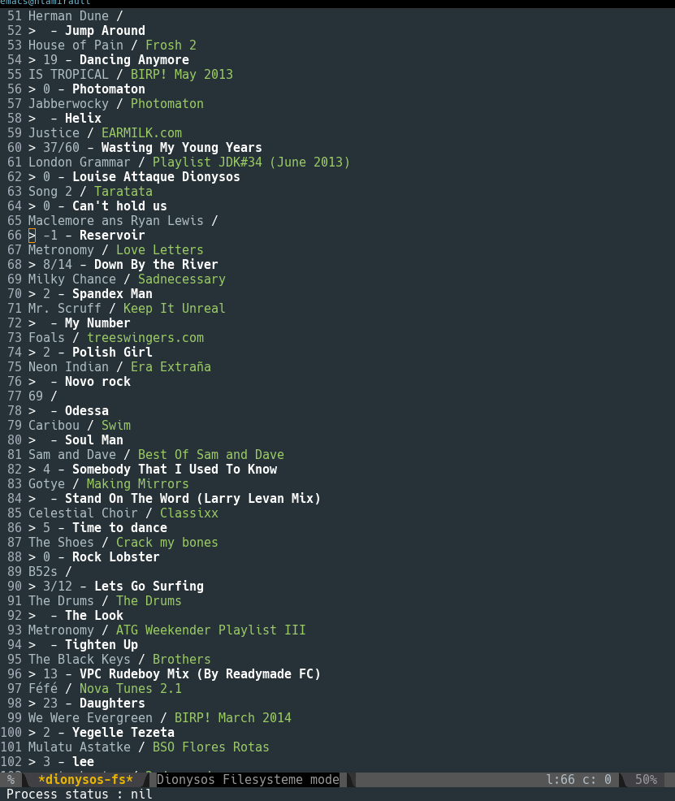
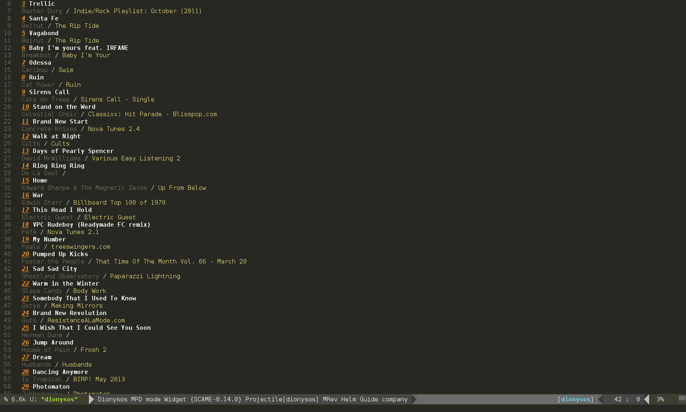

# Dionysos

[![License GPL 2][badge-license]][LICENSE]

* Master : [](https://stable.melpa.org/#/dionysos) [](https://circleci.com/gh/nlamirault/dionysos/tree/master) [](https://coveralls.io/r/nlamirault/dionysos?branch=master)
* Develop: [](https://melpa.org/#/dionysos) [](https://circleci.com/gh/nlamirault/dionysos/tree/develop) [](https://coveralls.io/r/nlamirault/dionysos?branch=develop)


A simple music player for Emacs.

Backends available are :
* [vlc][]
* [mplayer][]
* [mpd][]

Tools used :
* [id3][]

## Installation

The recommended way to install ``dionysos`` is via [MELPA][]:

    M-x package-install dionysos

or [Cask][]:

	(depends-on "dionysos")


## Customization

```lisp
(setq dionysos-backend 'vlc
      dionysos-notify-p t
      dionysos-volume-cmd 'pamixer)
```

## Backend

You could use this backends : **vlc**, **mplayer** and **mpd**.
Setup your backend :

```lisp
(setq dionysos-backend 'vlc)
```

## Modes

### Filesystem

Listen to music files in a directory :

    M-x dionysos-fs-list

Keybinding           | Description
---------------------|------------------------------------------------------------
<kbd>c</kbd>         | start playing current position
<kbd>SPACE</kbd>     | stop music player
<kbd>n</kbd>         | play next song
<kbd>p</kbd>         | play previous song
<kbd>+</kbd>         | raise volume
<kbd>-</kbd>         | lower volume
<kbd>q</kbd>         | quit



### MPD

You could play songs from MPD playlist :

    M-x dionysos-mpd-playlist



In this mode, you could use manage MPD :

Keybinding           | Description
---------------------|------------------------------------------------------------
<kbd>n</kbd>         | Go to the next song
<kbd>n</kbd>         | Go to the previous song
<kbd>c</kbd>         | Play song from current position
<kbd>s</kbd>         | Start playing
<kbd>SPC</kbd>       | Stop playing
<kbd>+</kbd>         | Raise volume
<kbd>-</kbd>         | Decrease volume
<kbd>q</kbd>         | quit

## Development

### Cask

``dionysos`` use [Cask][] for dependencies management. Install it and retrieve
dependencies :

    $ curl -fsSkL https://raw.github.com/cask/cask/master/go | python
    $ export PATH="$HOME/.cask/bin:$PATH"
    $ cask

### Testing

* Launch unit tests from shell

        $ make clean test

* Using [overseer][] :

Keybinding           | Description
---------------------|------------------------------------------------------------
<kbd>C-c , t</kbd>   | launch unit tests from buffer
<kbd>C-c , b</kbd>   | launch unit tests
<kbd>C-c , g</kbd>   | launch unit tests with tag (find, regexp, ...)

* Tips:

If you want to launch a single unit test, add a specify tag :

```lisp
(ert-deftest test-foobar ()
  :tags '(current)
  ```

And launch it using : <kbd>C-c , g</kbd> and specify tag : *current*


## Support / Contribute

See [here](CONTRIBUTING.md)


## Changelog

A changelog is available [here](ChangeLog.md).


## License

See [LICENSE](LICENSE).


## Contact

Nicolas Lamirault <nicolas.lamirault@gmail.com>


[dionysos]: https://github.com/nlamirault/dionysos
[badge-license]: https://img.shields.io/badge/license-GPL_2-green.svg?style=flat
[LICENSE]: https://github.com/nlamirault/dionysos/blob/master/LICENSE
[Issue tracker]: https://github.com/nlamirault/dionysos/issues

[GNU Emacs]: https://www.gnu.org/software/emacs/
[MELPA]: https://melpa.org
[Cask]: http://cask.github.io/
[Overseer]: https://github.com/tonini/overseer.el

[vlc]: http://www.videolan.org/vlc/
[mplayer]: http://www.mplayerhq.hu/design7/news.html
[mpd]: https://www.musicpd.org/
[id3]: https://github.com/squell/id3]
